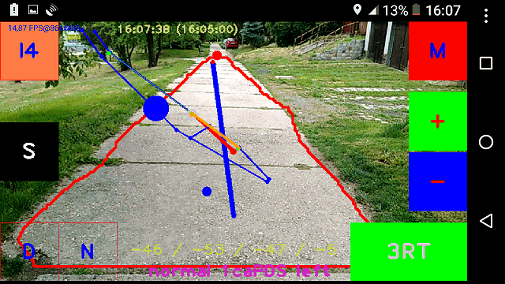

# RoboNav
RoboNav is Android application for visual navigation of mobile robots (OpenCV + BlueTerm)

**Notes:**
- application navigates to defined GPS waypoints and uses a camera to stay on road (by avoiding road edges)
- application sends bluetooth commands to robot (see below) [so you need a bluetooth enabled robot]
- RoboNav.apk is targeted for Android 2.3.3 Gingerbread (API level 10) [but also runs in higher versions of Android]
- RoboNav.apk requires OpenCV Manager installed on your Android system
- development environment is Eclipse ADT and OpenCV 3.4.0
- for proper function, you have to put map file RoboNavMap.txt (see map format below) into SD card root
- for conversion from OSM file to RoboNavMap.txt is available my online tool at http://www.vmoste.cz/RoboNav/maps/index.php 
- application at startup tries to connect to a paired and active bluetooth device nearby
- default screen orientation is portrait (changeable at preferences)
- you can define GPS waypoints directly on-screen at input mode 1 (long touch define waypoint with payload drop)
- operational logs are created automatically at root of SD card

**Active buttons (corners) on screen (in landscape orientation):**
- I (top left) = input mode (0/red = run, 1/green = define waypoints [then tap "S" button to save defined path to RoboNavPath.txt], 2/blue = define color for searching)
- S (center left) = save (to preferences and to RoboNavPath.txt)
- D (bottom left) = debug on/off (debug screen messages)
- N (bottom left) = next waypoint (set next waypoint as current)
- M/V (top right) = mute/voice switch (voice output is generated by TTS) [it reads sent commands and other changes]
- bottom right corner = search mode switch (incremental)
 - 0 = manual control (buttons for commands)
 - 1 = RobotemRovne (go straight, stay on the road, avoid obstacles)
 - 2 = RoboOrienteering (follow waypoints, detect and approach orange cones, drop payload)
 - 3 = RoboTour (follow waypoints, stay on the road, avoid obstacles, drop payload)
 - 4 = Road Assistance (planned feature)
 - 5 = Puck Collect (planned feature)
 - 6 = Line Follower (planned feature)
 - 7 = Ketchup House (planned feature)
 - 8 = Bear Rescue (planned feature)
 - 9 = Robo Carts (planned feature)
- "minus" and "plus" (center right) = set parameters (and show detection mode by colors, see below)
 - in input mode 1 you can set start time (for RoboTour competition [search mode 3])
 - in run mode (input mode 0) you can set threshold value (0 - 255) and road detection mode
    - 0 = HSV H+S, topPointDirection (blue - / blue +)
    - 1 = HSV H+S, topPointDirection + centroidDirection (blue - / green +)
    - 2 = HSV S, topPointDirection (green - / blue +)
    - 3 = HSV S, topPointDirection + centroidDirection (green - / green +)
    - 4 = HSV H+S, topPointDirection + course azimuth (black - / blue +)
    - 5 = HSV S, topPointDirection + centroidDirection + course azimuth (black - / green +)

- more preferences are available at bluetooth terminal (after quitting of visual navigation by standard "back" button in Android)

**RoboNav screenshot (example)**  
  
Search mode is 3 (RoboTour). Debug is off. Input mode is 0 (run). Voice output is muted. Blue dots and lines are part of the map. Green dots in the map are defined waypoints. Orange line is an actual section of the defined path. Grey outlined orange dot is an actual (next) waypoint. Red line is an actual azimuth (course). Red contour indicates detected road. Sloping blue line indicates navigation recommendation (turn left). Big blue circle is the sign of the actual command (left). Smaller blue circle (near the center) is the centroid of the detected road. Top red point indicates a top point of the detected road. Yellow numbers at top center shows an actual time and configured start time (in brackets). Yellow and violet numbers and characters at bottom center shows current state information (parameters, angles, mode, command).

**Supported serial/bluetooth commands for robot:**
- s = stop
- f or w = forward
- b or x = backward
- l or a = left
- r or d = right
- y = straight
- h = slightly left
- k = slightly right
- p = payload drop
- o = load payload (pick up)
- 0 - 9 = speed (0 - 9 [max])
- t = turn (reverse course)
- n = new target azimuth (actual)

```
Required map format (for RoboNavMap.txt) [example]:
0 49.3092137 14.1513494 0
1 49.309096 14.1504934 0
2 49.309726 14.1484146 0
3 49.3096508 14.1486873 0
4 49.3095187 14.1490986 0
0 1
0 2
2 3
3 4
(first few linas are in format "id latitude longitude 0" => nodes)
(last/shorter lines are in format "id1 id2" => edges)

Default serial/bluetooth telemetry from robot (about once per second):
-------------------------------------------------------------------------
          111111111122222222223333333333444444444455555555556666666666777
0123456789012345678901234567890123456789012345678901234567890123456789012
   cyc hea tgt  set dir rng dst spd ams      lat      lon lef rig bck pwm
-------------------------------------------------------------------------
cyc:  0 -  5 (cycles) [not used/recognized]
hea:  7 -  9 (heading: 0 - 359) [used in the algorithm] (if available)
tgt: 11 - 14 (steer target: -99 - +99) or desired heading [not used/recognized]
set: 16 - 18 (desired run direction: -1/0/1) or PWM [not used/recognized]
dir: 20 - 22 (actual run direction: -1/0/1) [not used/recognized]
rng: 24 - 26 (forward sonar range: 0 - 50) [dm] [used in the algorithm] (if available)
dst: 28 - 30 (total distance) [m] [used in the algorithm] (if available)
spd: 32 - 34 (actual speed) [cm/s] [used in the algorithm]
ams: 36 - 38 (avoiding/mode/odoState) or homolog/power/aux [not used/recognized]
lat: 40 - 47 (GPS lattitude: 48.00000 - 52.00000) [used in the algorithm] (if available)
lon: 49 - 56 (GPS longitude: 13.00000 - 15.00000) [used in the algorithm] (if available)
lef: 58 - 60 (left sonar range: 0 - 50) [dm] [used in the algorithm] (if available)
rig: 62 - 64 (right sonar range: 0 - 50) [dm] [used in the algorithm] (if available)
bck: 66 - 68 (back IR range: 0 - 255) [cm] [used in the algorithm] (if available)
pwm: 70 - 72 (driving PWM: 0 - 255) [not used/recognized]

You can define your own telemetry table in the RoboNavRobots.txt:
BTaddress1;robotName1;commandsTable1;telemetryTable1;
BTaddress2;robotName2;commandsTable2;telemetryTable2;

Default commandTable:
lrswfbhkptn
(extraLeft extraRight stop straight forward back left right payloadDrop turn newAzimuth)

Default telemetryTable:
...... hhh ...  ... ... fff ddd sss ... aaaaaaaa oooooooo lll rrr bbb www

Recognized characters:
space or .=anything, h=heading, d=distance, s=speed, a=lattitude, o=longitude, 
f=frontObstacleRange, l=leftObstacleRange, r=rightObstacleRange,
b=backObstacleRange, p=payload, w=pwm
```

**To-do:**
- automatic routing (find optimal path in the map)
- navigation through the crossroads
- GPS odometry
- visual detection and avoiding of obstacles
- video recording (to SD card)
- wifi telemetry and video streaming
- probability and artificial intelligence

**Changelog:**
- V1.9.8 2017-12-28 support for RoboNavRobots.txt and for telemetryTable   
- V1.9.7 2017-11-26 version for Robotour Marathon 2017/2018 (simplified log and screen layout)   
- V1.9.6 2017-05-31 version for Roboorienteering 2017 (parameters tuning, navigation to cone, maps, paths)
- V1.9.5 2017-05-08 version for Robotem Rovne 2017 (parameters tuning)
- V1.9.4 2016-07-19 version for RoboTour 2016 (safer navigation)
- V1.9.3 2016-05-29 version for RoboOrienteering 2016 (orange blob search)
- V1.9.2 2016-05-05 version for Robotem Rovne 2016 (shadow removal, compass, PID)
- V1.9.1 2015-12-06 support for commands "p" and "t" at manual control
- V1.9.0 2015-12-03 initial github version (earlier changes have been hidden)

_Author: Ales Holub (aholub@centrum.cz)_